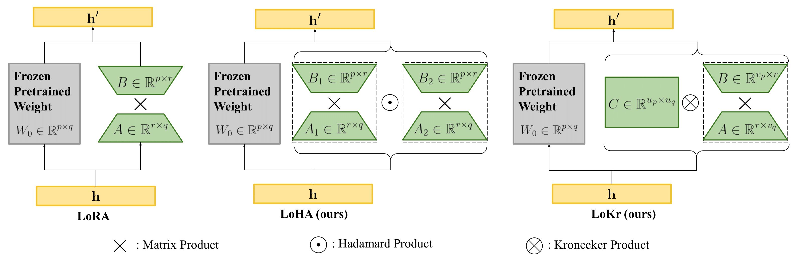
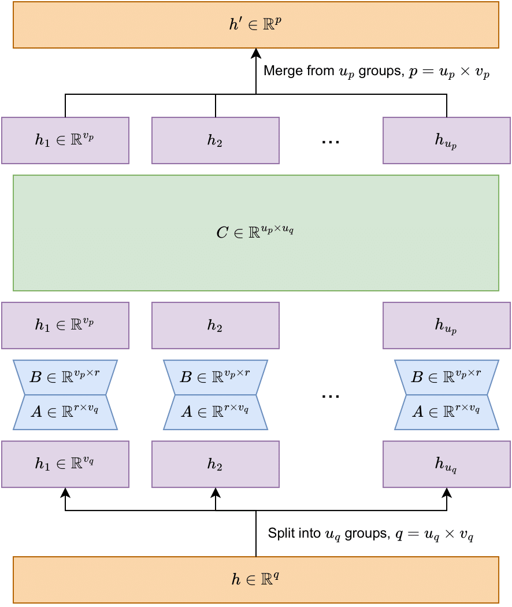

# Algorithm explanation


## Basic Idea




Linear Layer

$Y = W \cdot X$

We fine-tune to get $W'=W+\Delta W$

$Y = W' \cdot X = W \cdot X + \Delta W \cdot X$

LoRA-type methods focus on how we decompose $\Delta W$

($Y$ and $X$ are respectively $h'$ and $h$ in the above figure)


## From LoRA to LoCon

### LoRA for linear layers

$Y_{out \times batch} = W_{out \times in} \cdot X_{in \times batch}$

$\xrightarrow{} Y_{out \times batch} = W_{out \times in} \cdot X_{in \times batch} + B_{out \times dim} \cdot A_{dim \times in} \cdot X_{in \times batch}$

--

### LoRA for convolution

Consider im2col of matmul first:


$X:[channel, width, height]\xrightarrow{reorder}[c \times kw \times kh, outw \times outh]$

$Kernels: [out, c, kw, kh] \xrightarrow{reshape} [out, c \times kw \times kh]$

$Conv(X, Kernels) = Kernels  \times  X \xrightarrow{reshape} [out, outw, outh]$

and then write down this conventional LoRA for conv layer

$Conv(in, out, ksize, padding, stride)\xrightarrow{}Conv(dim, out, 1)\circ Conv(in, dim, ksize, padding, stride)$


In this method, we can get that
$\Delta W = B \cdot A$ with $rank(\Delta W) \le dim$

--

### LoRA for convolution with Tucker decomposition

Triggered by `use_tucker=True`

As mentioned above, the weight shape for convolution layer is $[out, in, kw, kh]$, and we just unfold it to $[out, in \times kw \times kh]$ for decomposition.

But actually there is a method to decompose any shape of tensor more efficiently called [Tucker decomposition](https://en.wikipedia.org/wiki/Tucker_decomposition).

Using Tucker decomposition in Covolution will give something like (with $\times_n$ representing n-mode product):

$\tau: [dim, dim, kw, kh]$ <br>
$x_1: [dim, out]$<br>
$x_2: [dim, in]$<br>
$W' = \tau \times_1 x_1 \times_2 x_2$<br>
$W': [out, in, kw, kh]$

Or write this thing as multiple conv layer:

Conv(in, dim, (1, 1))<br>
↓<br>
Conv(dim, dim, (kw, kh), stride, padding)<br>
↓<br>
conv(dim, out, (1, 1))<br>

For hadamard product implementation, just use 2 different $W'$ and multiply them together.


## LoHa

Image from [FedPara](https://arxiv.org/abs/2108.06098)


Consider $\Delta W = B \odot A$. We have $rank(\Delta W) \le rank(B) \times rank(A)$.
We then use conventional method on $B$ and $A$, which means it can use 2x dim to get square rank.

**Rank != Information capacity, but they may be related**

Based on the experiment result from the paper, it seems like although $rank(B) * rank(A)$ is just an upper bound, almost everytime it will produce $\Delta W$ with $rank(\Delta W) = rank(B)*rank(A)$.

### Why custom backward
With $\Delta W = (B_1 \cdot B_2) \odot (A_1 \cdot A_2)$, when you need to compute the backpropogation, you will need $\nabla_{\Delta W}$ and $A$ to compute $\nabla_B$, and $\nabla_{\Delta W}$ and $B$ to compute $\nabla_A$.

With pytorch's autograd, this kind of operation will cache both $B$ and $A$ for computing the backward, which means it will cache 2x size of weight for backward.

To avoid this terrible situation, LyCORIS implements a custom backward which will reconstruct $B$ and $A$ when actually needed, this method saved tons of memory.


## LoKr

### Kronercker Product

If $W_1$ is an $a \times b$ matrix and $W_2$ is a $c \times d$ matrix, then the Kronecker roduct of two matrices $W' = W_1 \otimes W_2$ is an $ac \times bd$ matrix.

In meaning of matrix, $W_2$ becomes weight and $W_1$ becomes weight scale of $W_2$

### About rank

And we can decompose $W_2$ using LoRA with rank  $r$.

$W_2 = Wa_2 \cdot Wb_2$ then $\Delta W = W_1 \otimes (Wa_2 \cdot Wb_2)$

We get $rank(\Delta W) \le rank(W_1) \times rank(Wa_2 \cdot Wb_2)$, $rank(W_1) \le min(a, b)$, and $rank(Wa_2 \cdot Wb_2) \le r$ 

=> $rank(W') \le min(a, b) \times r$

Put it simply, rank is mutiplicative under Kronecker product.

### Number of parameters

We decompose matrix, $\Delta W = W_1 \otimes (Wa_2 \cdot Wb_2) \in \mathbb{R}^{p\times q}$, with $p = ac$, $q = bd$

(# of parameters) = $(a \times b) + (c \times r + r \times d) = a \times b + r \times (c + d)$

When factor is set to -1, we roughly have $a=c= \sqrt{m}$ and $b=d= \sqrt{n}$

then, (# of parameters) = $\sqrt{mn} + r \times (\sqrt{m} + \sqrt{n})$

We can reduce the number of parameters to the order of square root of matrix width/height if we further decompose $W_1$

### As a sequence of linear layers

<p align="center">
  
</p>

## Sparse Bias
Todo...


## T-LoRA

### Motivation

Standard LoRA uses random initialization for its low-rank matrices. This means different rank components can learn correlated features, leading to interference. T-LoRA addresses this through SVD-based orthogonal initialization, ensuring each rank component captures independent information.

Additionally, diffusion models have different requirements at different noise levels:
- **High noise (early denoising)**: Need structure-level adaptation
- **Low noise (late denoising)**: Need detail-level adaptation

T-LoRA enables timestep-dependent rank masking to dynamically control how many ranks are active during training.

### Mathematical Formulation

For a weight matrix $W \in \mathbb{R}^{m \times n}$, we compute its SVD:

$W = U \Sigma V^T$

We then initialize T-LoRA components from the top-k (or bottom-k, or middle-k) singular vectors:

$Q = V_{:k}^T \in \mathbb{R}^{k \times n}$ (down projection, orthogonal rows)<br>
$P = U_{:,:k} \in \mathbb{R}^{m \times k}$ (up projection, orthogonal columns)<br>
$\lambda = \Sigma_{:k} \in \mathbb{R}^{k}$ (learnable singular values)

The weight delta is computed as:

$\Delta W = P \cdot \text{diag}(\lambda \odot mask) \cdot Q - P_{base} \cdot \text{diag}(\lambda_{base} \odot mask) \cdot Q_{base}$

The subtraction of the base state ensures that at initialization (when P, Q, $\lambda$ equal their base values), the delta is zero regardless of the mask.

### Timestep-Dependent Rank Masking

The mask is computed based on the current denoising timestep:

```python
r = int(((max_timestep - timestep) / max_timestep) ** alpha * (max_rank - min_rank)) + min_rank
mask = [1, 1, ..., 1, 0, 0, ..., 0]  # First r entries are 1
```

This creates a progression:
- At t=1000 (pure noise): only min_rank ranks active
- At t=500 (mid-denoising): roughly half ranks active
- At t=0 (final detail): all ranks active

### Orthogonality Regularization

T-LoRA can optionally include an orthogonality regularization loss:

$L_{ortho} = ||P^T P - I||_F^2 + ||Q Q^T - I||_F^2$

This encourages P and Q to remain orthogonal throughout training, preserving the independence of rank components.

### sig_type Options

- **principal**: Use top-k singular vectors (largest singular values). Best for preserving the model's main learned features.
- **last**: Use bottom-k singular vectors (smallest singular values). Perturbs the "unused" subspace of the original weights.
- **middle**: Use middle-k singular vectors. Balances between principal and unused subspaces.

### Usage with Training Frameworks

Training frameworks must set the timestep mask before each forward pass:

```python
from lycoris.modules.tlora import set_timestep_mask, compute_timestep_mask

# In training loop:
mask = compute_timestep_mask(
    timestep=current_timestep,
    max_timestep=1000,
    max_rank=lora_dim,
    min_rank=1,
    alpha=1.0,
)
set_timestep_mask(mask)
output = model(noisy_latents, timestep, ...)
```

### As a sequence of operations

<p align="center">
Input → Q (orthogonal projection) → scale by λ*mask → P (orthogonal projection) → Output
</p>

With residual subtraction from base state to ensure zero contribution at initialization.

## RaLoRA / RaLoRA-Pro

### Motivation

Standard LoRA uses a fixed low rank (typically r=8) for all layers. However, the *gradient intrinsic dimensionality* (GID) — the number of effective update directions in full fine-tuning gradients — can be 30-100× larger. This mismatch between LoRA's low-rank subspace and the true gradient space limits expressiveness, especially on complex tasks.

RaLoRA addresses this by **structurally aligning** each adapter's capacity with the per-layer GID, without increasing total parameter count.

### RaLoRA: Gradient Intrinsic Dimensionality Alignment

RaLoRA generalizes LoRA using **block-diagonal decomposition**. The LoRA matrices A and B are split into n_l mini-blocks:

```
ΔW = diag(B₁A₁, B₂A₂, ..., B_nA_n)
```

where A_i ∈ R^(r × d_in/n_l) and B_i ∈ R^(d_out/n_l × r).

The number of blocks n_l is determined adaptively per layer:

```
e_l = ⌊log₂(erank(G_l) / r)⌋
n_l = 2^clip(e_l, 0, log₂(n_max))
```

**Equivalent rank = n_l × r**, with the same parameter count as vanilla LoRA: r(d_in + d_out).

When GID is low, n_l=1 (identical to vanilla LoRA, focusing on dominant directions). When GID is high, n_l increases, trading per-direction precision for broader expressivity.

### RaLoRA-Pro: Dual Alignment

RaLoRA-Pro extends RaLoRA by also reallocating the rank budget across layers guided by **loss sensitivity**:

```
I(W_l) = avg(|W_l ⊙ G_l|)
α_l = I_l / Σ_k I_k
r_l = clip(round(P_total × α_l / √(d_in^l + d_out^l)), r_min, r_max)
```

This provides **dual alignment**: intra-layer (GID → n_l) and inter-layer (importance → r_l).

### Precomputation Phase

RaLoRA requires a one-time precomputation phase before training to:

1. Collect gradients on frozen pretrained weights over N mini-batches
2. Compute per-layer GID via entropy-based effective rank (or alternative methods)
3. (RaLoRA-Pro) Compute importance scores and allocate per-layer ranks
4. Compute n_l per layer and initialize block-diagonal weights

### Usage

```python
from lycoris.modules.locon import RaLoRAModule

# Create RaLoRA network
lycoris_net = create_lycoris(model, 1.0, linear_dim=8, linear_alpha=8, algo="ralora",
                             ralora_n_max=32, ralora_pro=True)
lycoris_net.apply_to()

# Run precomputation (ONCE before training)
RaLoRAModule.precompute_and_init(
    model=model,
    dataloader=train_dataloader,
    forward_fn=lambda model, batch: model(**batch)[0],
    max_steps=64,
    save_dir="./ralora_metadata"
)

# Now start normal training loop
```

### See Also

- Ref: [Gradient Intrinsic Dimensionality Alignment](https://openreview.net/forum?id=kObvnQ6pUx) (ICLR 2026)
- Code: `lycoris/modules/locon.py` (`RaLoRAModule`), `lycoris/modules/ralora_utils.py`
